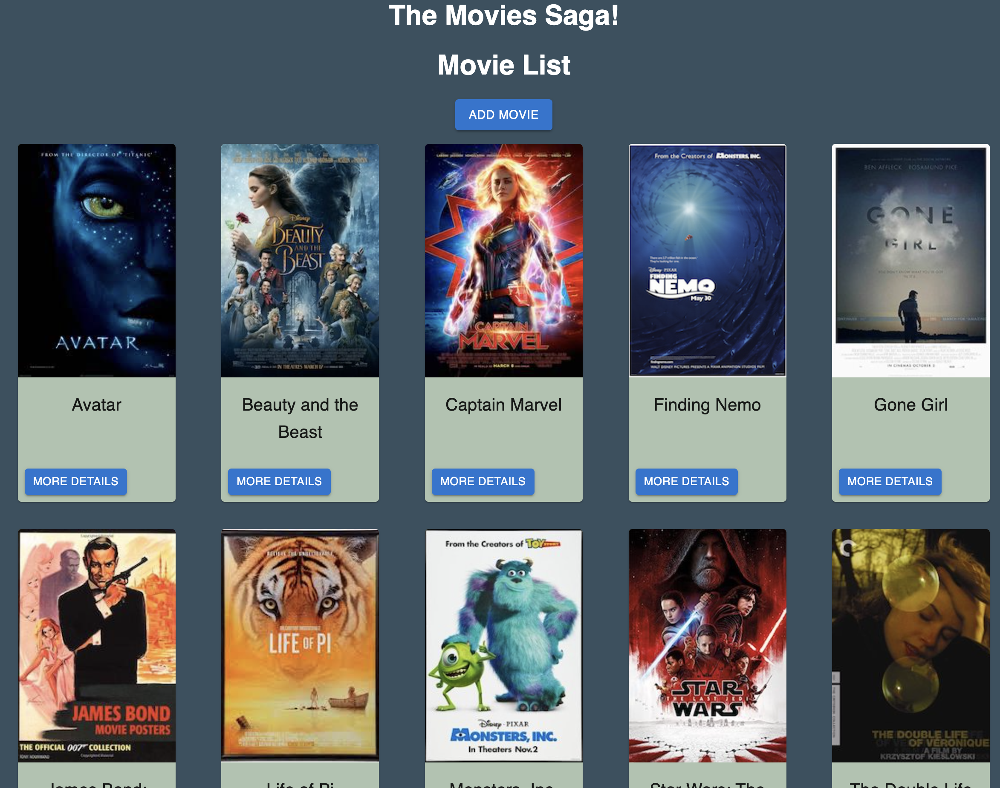
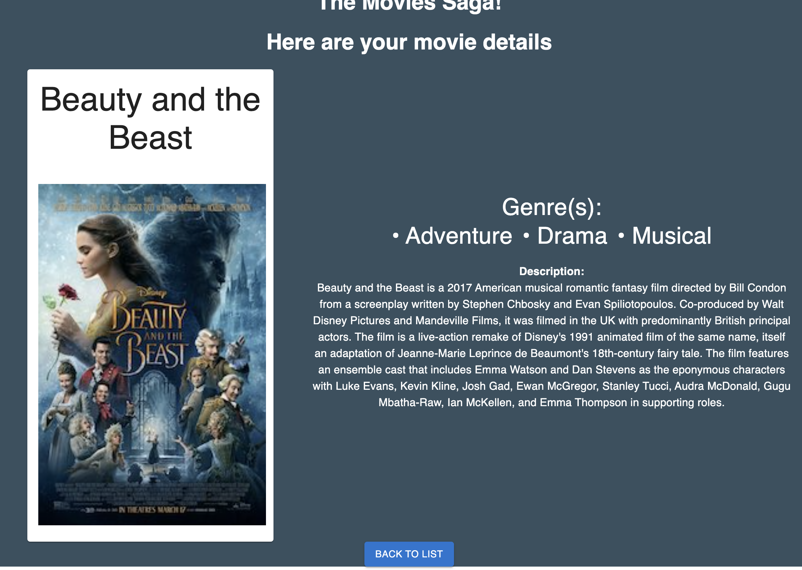

# Movies Saga Project

## Description

This app is primarily for demonstrating the use of Redux and Redux Sagas in switching to a detailed view of a user's selection with all the included informationa about that selection, in this case, movies!

A user can click on any of the movie posters or the helpful "details" button to navigate to a new page with a larger version of that movie poster along with a detailed description of the movie as well as all of its genres. The user can then click to return back to the full list of movies that have been added to the movie list.

More adventurous users can obtain a movie poster URL and add their movie to the database by filling out the information on the Add Movie page and clicking submit. A pop-up will halt the submission and remind the user if they have forgotten to include any of the necessary information.

The app ensures that added movies are immediately included in the list and that even if a user accidentally refreshes their details page, the details will remain on display.

Material UI cards and buttons have been included to improve the user experience.

### Screenshots
#### The main page

#### The Details page

#### Adding a movie

### Skills Practiced
- Javascript
- React
- Material UI
- Redux
- Sagas
- Express & Node
- PostgreSQL
- HTML & CSS

### Steps taken to build this project
- [x] Look over existing code
- [x] details GET with `movie.id`
	- [x] details include title, description, image
	- [x] Use Redux to handle requests
	- [x] `req.params.id`
    - [x] Include genre ID in a separate GET
- [x] Stylize and utilize MUI for displaying information to user
- [x] MUI Card for movie poster display
- [x] Flexbox to display movies in a grid

- [x] Add Movie Form
	- [x] Input field for title
	- [x] Input for image URL
	- [x] textarea for description
	- [x] dropdown for genre
	- [x] Cancel button returns to homepage
- [x] Save button saves inputs and returns to homepage with new movie displayed
- [x] Ensure SQL agreement between genre and movie tables when adding new movie
- [x] App refresh on details page (`useParams`)

### Built with
- Javascript
- React
- Redux
- Express & Node
- Material UI
- Postgres

#### Acknowledgements
Thanks to Prime Digital Academy for the continuing challenge of developing my webdev skills

#### Support
If you have suggestions or issues please email me at TBD